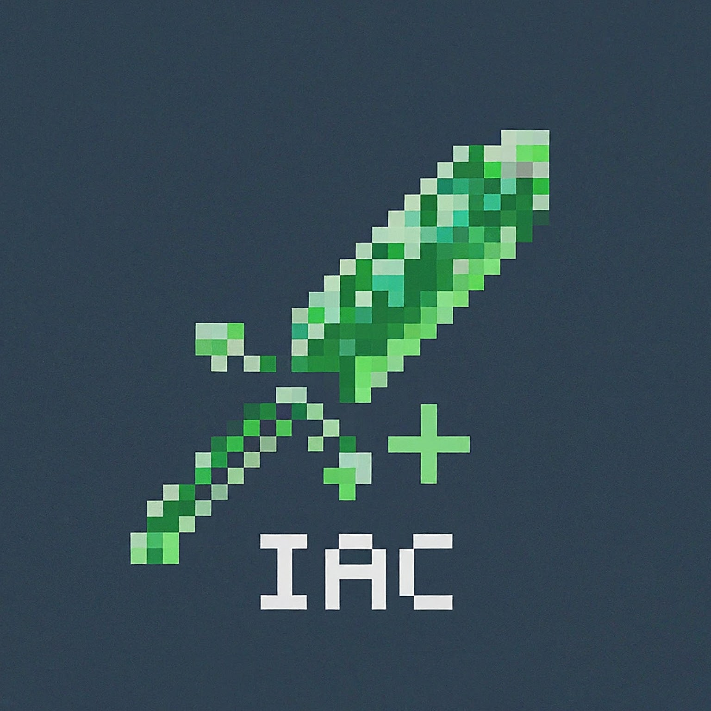

# IACreator

### The Ultimate ItemsAdder Addon Creation Tool

##### [简体中文](./README_zh.md) | English

IACreator is an open-source software based on the JavaFX framework, designed to provide a quick, convenient, and easy solution for creating ItemsAdder Addons. Whether you are a Minecraft server administrator, an Addon developer, or simply interested in ItemsAdder, IACreator can help you effortlessly create your own personalized Addons.

## Features
### 1. User-Friendly Interface
IACreator boasts an intuitive and easy-to-use interface that allows you to get started quickly. With just a few clicks of the mouse, you can create an ItemsAdder Addon.
### 2. Data Visualization
Displays the attributes and names of the content in your Addon in a visual manner, giving you a clearer understanding and easier adjustment of your Addon.
### 3. Automatic Configuration
Offers automatic configuration functionality. You just need to create the Addon through the interface, and let ItemsAdder handle the rest!
### 4. One-Key Packaging
Supports one-key packaging of Addons, generating a finished product that can be directly dragged into the contents folder of the ItemsAdder plugin.
### 5. Open Source and Free
IACreator is completely open source and free to use. You can build upon it for secondary development, customizing the features to suit your needs.

## System Requirements
- Operating System: Windows, macOS, Linux
- Java Version: Java 17
- ItemsAdder Version: v3.3.0+

## Download and Installation
- Download from [Github Releases](https://github.com/alazeprt/IACreator/releases)
- Download from [Github Actions](https://github.com/alazeprt/IACreator/actions)
- Clone/download the [IACreator source code](https://github.com/alazeprt/IACreator) and run it

## Feedback and Support
If you encounter any issues, or have any suggestions or requests while using IACreator, please feel free to contact us at any time via the following methods:
- Issues: [IACreator GitHub Issues](https://github.com/your-username/IACreator/issues)

#### Thank you for your interest and support in IACreator. We will continue to optimize and improve the software, providing you with an even better experience!
